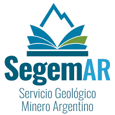

<div style="text-align: center">

## Programa Nacional de Cartas Geológicas
## de la República Argentina
## 1:250.000

Hoja Geológica 3169–I Rodeo

Provincia de San Juan

Raul Cardó e Iris N. Díaz

Geología Estructural: Marcelo Cegarra, Nemesio Heredia y Roberto Rodríguez Fernández

Petrografía: Graciela Santamaría

Supervisión: Luis Fauqué

Instituto Geológico y Minero de España

Normas, dirección y supervisión del Instituto de Geología y Recursos Minerales

SERVICIO GEOLÓGICO MINERO ARGENTINO
INSTITUTO DE GEOLOGÍA Y RECURSOS MINERALES

Boletín Nº 272

Buenos Aires - 2005

```{r picture, echo = F,  out.width = '20%'}

```

<div/>

